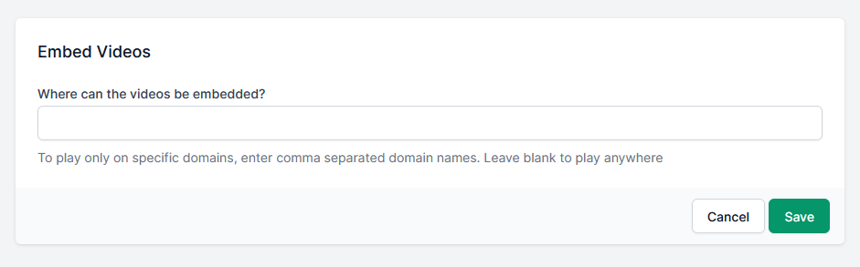

# Domain restriction

By default vidoes not domain restricted, so anyone can embed your video onto any page on the internet if they have embed code.

## Restrict where your video can be embedded

- Go to this path in your site **settings/video-embedding/**
 
 

- Add your website’s subdomain (subdomain.mysite.com) in the text field that appears; be sure to click save to add it. You can specify and manage up to 50 domains where your video can be embedded.
- Wildcard characters are not supported.